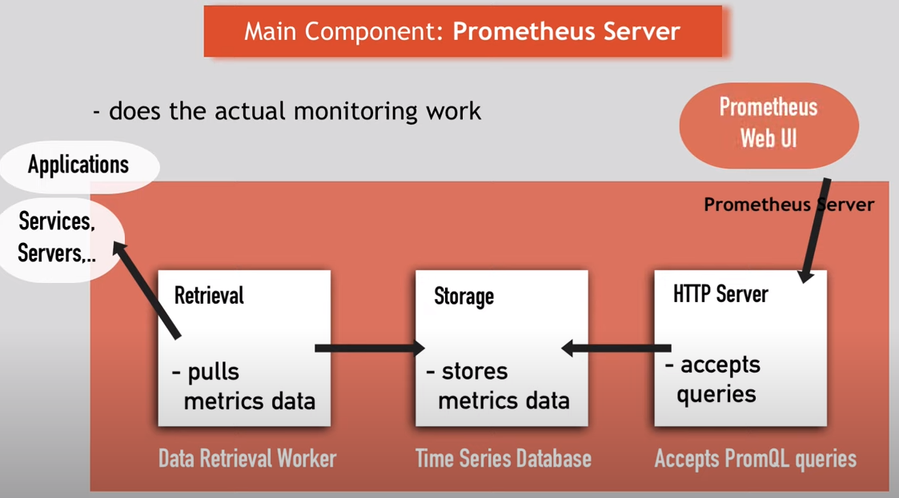

# Monitoring: Prometheus / Grafana vs FB's ODS
- Prometheus and Facebook's ODS (Observability Distribution System) are both monitoring tools used to collect metrics, logs, and traces from various systems and applications.
  - Architecture: 
	- Prometheus follows a pull-based model where the metrics are scraped from the targets (servers, services, applications) by the Prometheus server at regular intervals. 
	- 
     - ODS, on the other hand, follows a push-based model where the metrics are pushed by the agents (running on the targets) to the ODS server.
  - Data Model: 
	1. Prometheus uses a time-series data model where each metric is represented by a unique combination of a name and a set of labels, along with a timestamp and a value. 
	2. Facebook's ODS also uses a time-series data model to store and query metrics. Each metric in ODS is represented by a unique combination of metric name and labels, along with a timestamp and a value. The labels are used to provide additional dimensions for the metrics and can be used to filter, aggregate and group the metrics in various ways.
  - Query Language: 
	1. Prometheus uses its own query language called PromQL, which is designed to work with the time-series data model. 
	2. ODS, on the other hand, supports SQL-like queries that can be used to query the hierarchical data model.
  - UI:
	1. Prometheus could be intergrated with Grafana Visualisation