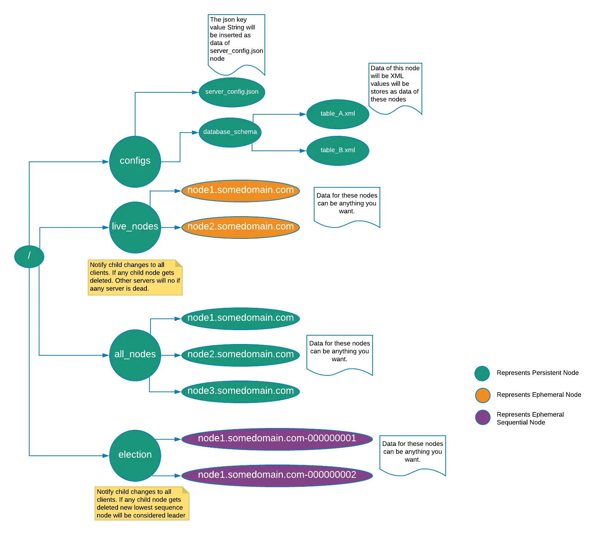

# Key generator
- UUID
- Multiple MySQL with self increasing ID
  - rond-robin load balance.
  - if 8 nodes, each node +8 for generated IDs
  - Twitter Snowflake
    - timestamp (41bits) + node_id (10bits) + increasing sequences (12bits)
# Coordination
## Zookeeper
- It addresses coordination problems in distributed systems, including configuration management, leader election, distributed locks, and managing cluster membership.
- 📊 ZooKeeper Data Model: ZooKeeper features a hierarchical namespace, and each node (znode) can hold data and children.
  - uses a tree-like file system structure called znodes and provides primitive operations to manipulate them.
    - Persistent Znodes are permanently stored, while ephemeral Znodes are automatically deleted when the client disconnects.
    - 🌟 Ephemeral Nodes: These nodes exist as long as the session that created them is active. ephemeral Znodes are automatically deleted when the client disconnects.
    - 🔢 Sequence Nodes: Znodes can have monotonically increasing counters appended to their names. Ephemeral sequential Znodes have sequential numbers as suffixes and are useful for leader election.
- 🔍 Watches: Clients can set watches on znodes to receive notifications of changes.
- 📂 Data Access: Data stored in znodes can be read and written atomically.
- 🕰️ Time in ZooKeeper: ZooKeeper uses zxids and version numbers to track changes, not real-time.
- 📊 ZooKeeper Stat Structure: Contains metadata about a znode, including creation time and version information.
- 🔌 ZooKeeper Sessions: Clients establish sessions with ZooKeeper servers and manage state transitions.
- 🚀 Consistency Guarantees: ZooKeeper provides guarantees about data consistency.
### Examples:
[good example](https://bikas-katwal.medium.com/zookeeper-introduction-designing-a-distributed-system-using-zookeeper-and-java-7f1b108e236e)
#### Leader election:
- 🦋 In the leader election process:
  - Servers add a watch to the /election znode.
  - Servers create an ephemeral znode /leader under /election with their hostname as data.
  - Only one server succeeds in creating /leader, becoming the leader.
  - Servers call getChildren("/election") to find the leader's hostname.
  - 🦁 If the leader server goes down:
    - Zookeeper terminates its session after a timeout.
    - Deletes the /leader node, which is ephemeral.
    - Notifies all servers watching /election znode.
  - 🐏 When servers receive the leader's deletion notification:
    - They retry creating /leader, and one becomes the new leader.
    - Zookeeper notifies all servers again.
- 🐘 In Approach 2 for leader election:
  - Servers create ephemeral sequential znodes under /election.
  - The one with the least sequence number becomes the leader.
  - No extra write requests upon leader failure, reducing network traffic.
- 🐬 Approach 3 for leader election:
  - Servers set watches on child znodes with one less sequence.
  - If a leader goes down, only the next candidate is notified.
  - Reduces the herd effect.
#### Distributed locks
- The algorithm for managing distributed locks is the same as the leader election with a slight change.
  - Instead of the /election parent node, we will use /lock as the parent node.
  - The rest of the steps will remain the same as in the leader election algorithm. Any server which is considered a leader is analogous to the server acquiring the lock.
  - The only difference is, once the server acquires the lock, the server will perform its task and then call the delete operation on the child znode it has created so that the next server can acquire lock upon delete notification from zookeeper and perform the task.
#### Group membership/managing cluster state
- use a persistent znode to keep track of all the servers that join the cluster and the zookeeper’s ability to delete ephemeral znodes upon client session termination will come in handy in maintaining the list of active/live servers.
  - Create a parent znode /all_nodes, this znode will be used to store any server that connects to the cluster.
  - Create a parent znode /live_nodes, this znode will be used to store only the live nodes in the cluster and will store ephemeral child znodes. If any server crashes or goes down, the respective child ephemeral znode will be deleted.
  - Any server connecting to the cluster will create a new persistent znode under /all_nodes say /node1.domain.com. Let’s say another two-node joins the cluster. Then the znode structure will look like this:
    - /all_nodes/node1.domain.com
    - /all_nodes/node2.domain.com
    - /all_nodes/node3.domain.com
  - You can store any information specific to the node in znode’s data.
  - Any server connecting to the cluster will create a new ephemeral znode under /live_nodes say /node1.domain.com. Let’s say another two-node joins the cluster. Then the znode structure will look like this:
    - /live_nodes/node1.domain.com
    - /live_nodes/node2.domain.com
    - /live_nodes/node3.domain.com
  - Add a watch for any change in children of /all_nodes. If any server is added or deleted to/from the cluster, all server in the cluster needs to be notified.
  - Add a watch for any change in children of /live_nodes. This way all servers will be notified if any server in the cluster goes down or comes alive.

# Message Queue
## Kafka
- structure:
  - broker nodes
    - topic: crossing multiple brokers via partitions
      - partition: each broker holds multiple partitions
      - replicas: partition will be replicated to other brokers
- support both read-heavy and write-heavy
  - persistent data
  - log data to disk -- append only
- partition decision
  - Producer Message Distribution:

  -  Partitioner: Kafka provides a configurable component called a "partitioner." The partitioner is responsible for determining which partition a producer's message should be assigned to within a specified topic. The partitioner uses a certain strategy to make this decision, such as round-robin, random selection, or a custom logic based on message attributes. The producer specifies the partitioner implementation when creating a Kafka producer.
  - Consumer Partition Assignment:

    - Group Coordinator: Kafka maintains the concept of a "group coordinator" for each consumer group. The group coordinator is responsible for managing the assignment of partitions to consumers within the group. It ensures that partitions are evenly distributed among consumers and handles rebalancing when consumers join or leave the group.

    - Consumer Group Protocol: Kafka consumers use a consumer group protocol to coordinate and make partition assignment decisions. The protocol includes mechanisms for consumers to negotiate which partitions they will consume from based on their current state and the partitions available in the topic. Kafka's default behavior aims to distribute partitions as evenly as possible among consumers in the group.

    - Offset Management: Kafka consumers also maintain their own offset information for the partitions they are assigned to. They record the last processed message offset for each partition. This allows consumers to resume reading from where they left off in case of failures or restarts.
- from the point view of kafka, it keeps no state on what the consumers are reading from a topic
  - When a consumer group is created, Kafka automatically assigns partitions from subscribed topics to the consumers within the group. Each partition is assigned to exactly one consumer within the group. This ensures that each message in a partition is processed by only one consumer within the group, allowing for load balancing and parallelism.
- a producer must know which partition to write to, this is not up to the broker
  - It's possible for the producer to attach a key to the record dictating the partition the record should go to. All records with the same key will arrive at the same partition. Before a producer can send any records, it has to request metadata about the cluster from the broker. The metadata contains information on which broker is the leader for each partition and a producer always writes to the partition leader. The producer then uses the key to know which partition to write to, the default implementation is to use the hash of the key to calculate partition, you can also skip this step and specify partition yourself.
- consumer vs consumer group
  - each consumer will read independently, for example, notification message
  - consumers within the same consumer group read the topic together, and each consumer in the group will read a different partition
    - working together in parallel (workers)
- the Kafka consumer follows a similar pattern to the Kafka producer. Kafka provides client libraries for various programming languages, and consumers are typically developed as custom applications using these libraries. 
  - Producer:
    - Buffering Messages: When a producer sends messages to Kafka, it doesn't immediately send each message as a separate request. Instead, it buffers messages in memory and groups them into batches. The producer specifies a maximum batch size or a maximum time interval for how long it will wait before sending a batch.
    - Compression: Kafka producers often apply message compression to reduce the size of messages before adding them to a batch. This is especially useful when sending large volumes of data. Kafka supports various compression algorithms, such as gzip, snappy, and lz4.
    - Topic-Partition Assignment: Messages within a batch are typically destined for the same topic and partition. Kafka ensures that messages intended for a specific topic-partition combination are grouped together.
    - Acknowledgment: Producers can configure acknowledgment settings to determine when a batch is considered "sent." For example, a producer can choose to wait for acknowledgment from the broker after all messages in a batch are successfully written, or it can configure acknowledgment for each message individually.
    - Background Sending: The Kafka producer operates in the background, continuously monitoring the buffered messages. When a batch size or time interval threshold is reached, the producer initiates a send operation to transmit the batch to the Kafka broker.
    - Retries: If a batch cannot be successfully sent to the broker due to network issues or broker unavailability, the producer can be configured to retry sending the batch after a certain number of retries or a specified retry delay.
    - Configurability: Kafka provides producers with various configuration options to fine-tune the batching behavior, including batch size, linger time (maximum wait time for accumulating messages in a batch), and compression settings.
  - Consumer:
    - Consumer Application: Customers can build their own consumer applications using the Kafka client libraries. These applications are responsible for subscribing to Kafka topics, fetching and processing messages, and handling various aspects of message consumption.
    - Customization: Consumer applications can be customized to define how messages are processed, including deserialization, data transformation, business logic, and error handling.
    - Configuration: Kafka consumers can be configured with various settings, such as the Kafka broker endpoints, consumer group ID, topic subscriptions, message offset management, and more.
    - Integration: Consumer applications can be integrated into a broader data processing pipeline, application architecture, or microservices environment to consume messages from Kafka topics and take appropriate actions based on the message content.
    - Scaling: Kafka consumers can be scaled horizontally to handle increased message throughput and provide fault tolerance. This can be achieved by deploying multiple consumer instances within a consumer group.
