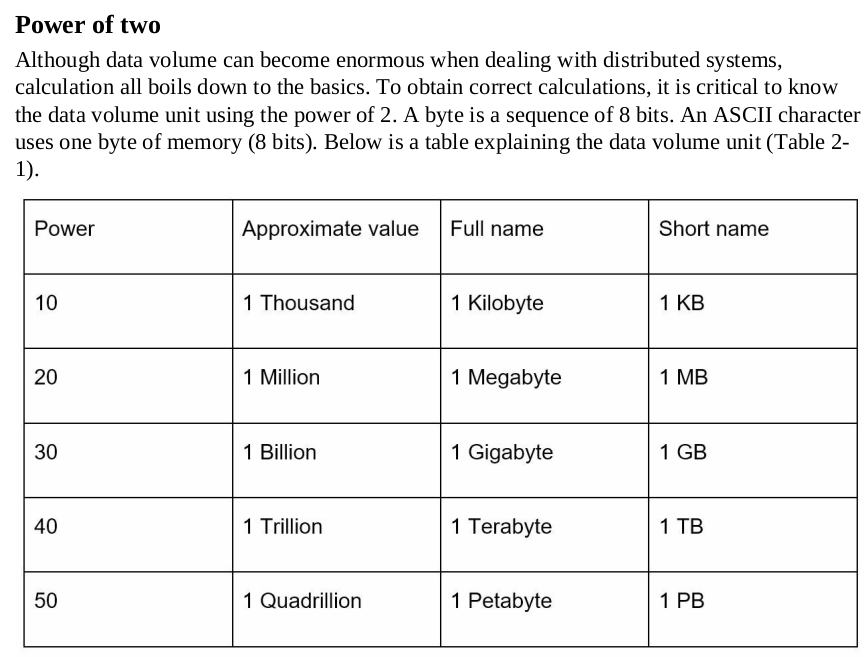
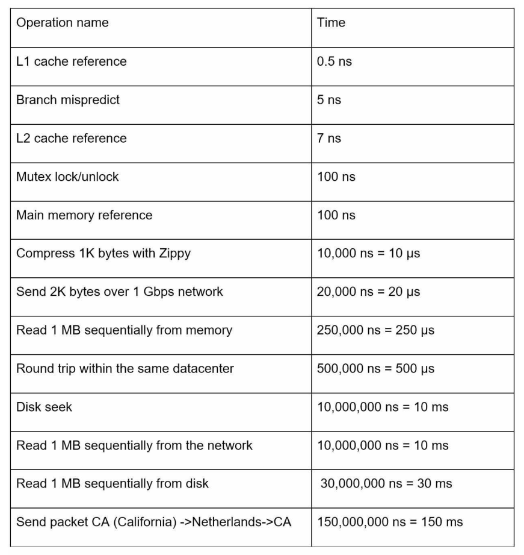
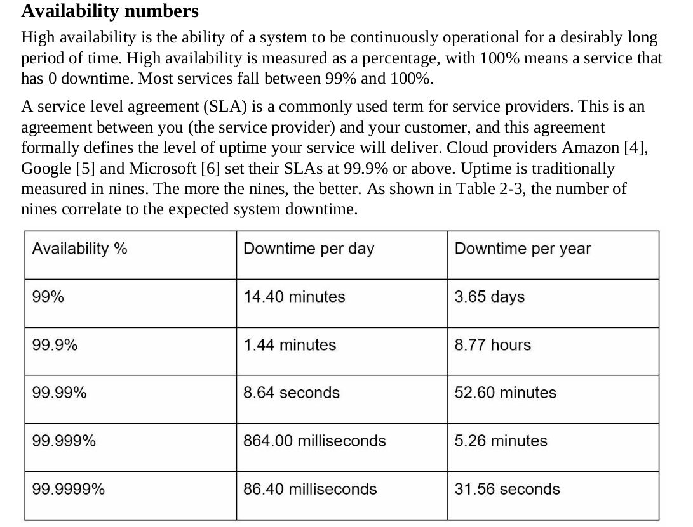
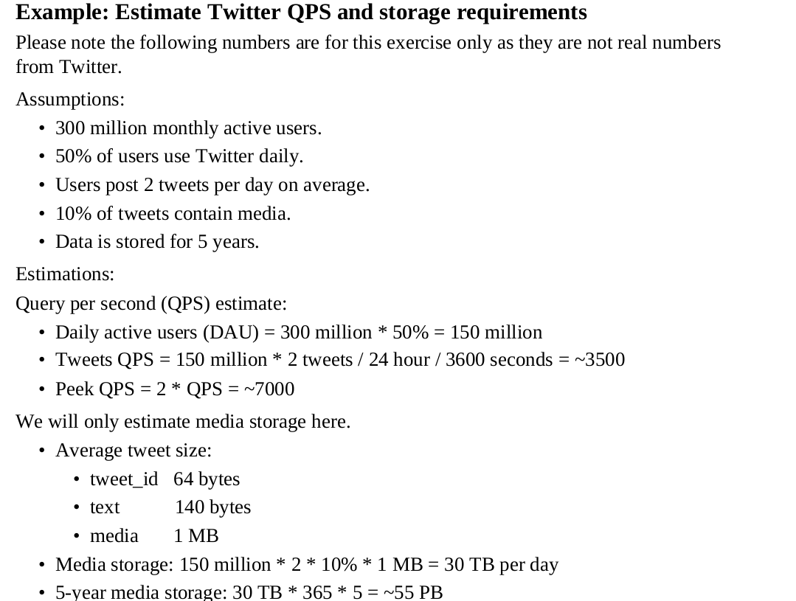

# Back-of-the-envelope estimation
- Data volume unit 
- 
- Latency
- 
- Avaliability
- 
- QPS and storage requirements
- 
# DB QPS ability
- modern SQL servers are designed to handle high volumes of queries and support high concurrency. With a well-designed database schema and appropriate indexing, it is possible to achieve thousands or even tens of thousands of QPS on a single SQL server.
- NoSQL databases are designed to scale horizontally and support high levels of concurrency, making it possible to achieve very high QPS numbers in distributed deployments. For example, some NoSQL databases like Cassandra, MongoDB, and Apache CouchDB are capable of handling tens of thousands to hundreds of thousands of QPS per cluster node in certain scenarios.
	- Non-relational databases might be the right choice if:
		- Your application requires super-low latency.
		- Your data are unstructured, or you do not have any relational data.
		- You only need to serialize and deserialize data (JSON, XML, YAML, etc.).
		- You need to store a massive amount of data.