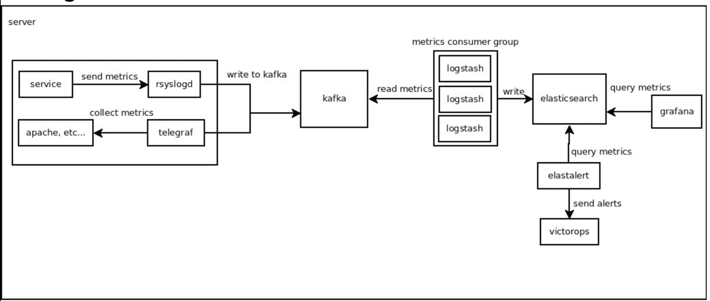
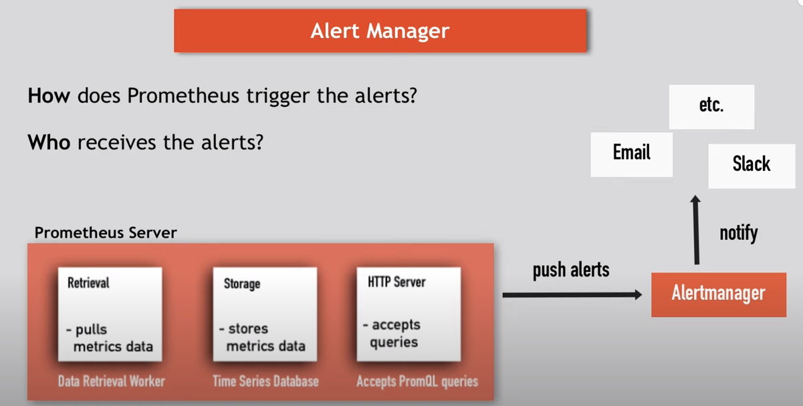

# System
- 
# Alerting
- Alertmanager can group alerts it detects to be related; for example, a major network outage might result in hundreds of individual alerts, but Alertmanager can group all of these into a single message, so that responders aren’t overwhelmed with pages.
- 
# Service Discovery