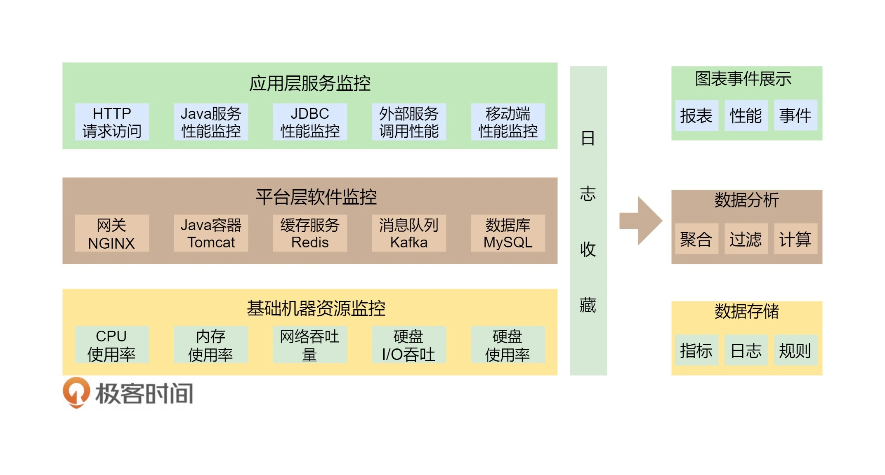

# State Watch
- Clients are interested in specific server value changes but continuous polling can be inefficient and overwhelming. A solution involves clients registering interest with the server for notifications on state changes, using a single socket channel and a request pipeline. This applies to a key-value store, and both client and server sides require implementations.
- Examples include Zookeeper and Etcd for event-based notifications.
# Idea
- 这个监控系统需要完成的功能为：
  - 全栈监控；
  - 关联分析；
  - 跨系统调用的串联；
  - 实时报警和自动处置；
  - 系统性能分析。 
- 多层体系的监控所谓全栈监控，其实就是三层监控。
  - 基础层：监控主机和底层资源。比如：CPU、内存、网络吞吐、硬盘 I/O、硬盘使用等。
  - 中间层：就是中间件层的监控。比如：Nginx、Redis、ActiveMQ、Kafka、MySQL、Tomcat 等。
  - 应用层：监控应用层的使用。比如：HTTP 访问的吞吐量、响应时间、返回码、调用链路分析、性能瓶颈，还包括用户端的监控。
  - 

- 这还需要一些监控的标准化。
  - 日志数据结构化；
  - 监控数据格式标准化；
  - 统一的监控平台；
  - 统一的日志分析。
- 什么才是好的监控系统
  - 关注于整体应用的 SLA。主要从为用户服务的 API 来监控整个系统。
  - 关联指标聚合。 把有关联的系统及其指标聚合展示。主要是三层系统数据：基础层、平台中间件层和应用层。其中，最重要的是把服务和相关的中间件以及主机关联在一起，服务有可能运行在 Docker 中，也有可能运行在微服务平台上的多个 JVM 中，也有可能运行在 Tomcat 中。总之，无论运行在哪里，我们都需要把服务的具体实例和主机关联在一起，否则，对于一个分布式系统来说，定位问题犹如大海捞针。
  - 快速故障定位。 对于现有的系统来说，故障总是会发生的，而且还会频繁发生。故障发生不可怕，可怕的是故障的恢复时间过长。所以，快速地定位故障就相当关键。快速定位问题需要对整个分布式系统做一个用户请求跟踪的 trace 监控，我们需要监控到所有的请求在分布式系统中的调用链，这个事最好是做成没有侵入性的
- 换句话说，一个好的监控系统主要是为以下两个场景所设计的。
  - “体检”
    - 容量管理。 提供一个全局的系统运行时数据的展示，可以让工程师团队知道是否需要增加机器或者其它资源。
    - 性能管理。可以通过查看大盘，找到系统瓶颈，并有针对性地优化系统和相应代码。

  - “急诊”
    - 定位问题。可以快速地暴露并找到问题的发生点，帮助技术人员诊断问题。
    - 性能分析。当出现非预期的流量提升时，可以快速地找到系统的瓶颈，并可以帮助开发人员深入代码。
- 如何做出一个好的监控系统

  - 服务调用链跟踪。这个监控系统应该从对外的 API 开始，然后将后台的实际服务给关联起来，再将这个服务的依赖服务给关联起来，直到最后一个服务（如 MySQL 或 Redis），这样就可以把整个系统的服务全部都串连起来了。这个事情的最佳实践是 Google Dapper 系统，其对应于开源的实现是 Zipkin。对于 Java 类的服务，我们可以使用字节码技术进行字节码注入，做到代码无侵入式。
  - 服务调用时长分布。使用 Zipkin, 可以看到一个服务调用链上的时间分布，这样有助于我们知道最耗时的服务是什么。下图是 Zipkin 的服务调用时间分布。
  - 服务的 TOP N 视图。所谓 TOP N 视图就是一个系统请求的排名情况。一般来说，这个排名会有三种排名的方法：a）按调用量排名，b) 按请求最耗时排名，c）按热点排名（一个时间段内的请求次数的响应时间和）。
  - 数据库操作关联。对于 Java 应用，我们可以很方便地通过 JavaAgent 字节码注入技术拿到 JDBC 执行数据库操作的执行时间。对此，我们可以和相关的请求对应起来。
  - 服务资源跟踪。我们的服务可能运行在物理机上，也可能运行在虚拟机里，还可能运行在一个 Docker 的容器里，Docker 容器又运行在物理机或是虚拟机上。我们需要把服务运行的机器节点上的数据（如 CPU、MEM、I/O、DISK、NETWORK）关联起来。
- 有了这些数据上的关联，我们就可以达到如下的目标。
  - 当一台机器挂掉是因为 CPU 或 I/O 过高的时候，我们马上可以知道其会影响到哪些对外服务的 API。
  - 当一个服务响应过慢的时候，我们马上能关联出来是否在做 Java GC，或是其所在的计算结点上是否有资源不足的情况，或是依赖的服务是否出现了问题。
  - 当发现一个 SQL 操作过慢的时候，我们能马上知道其会影响哪个对外服务的 API。
  - 当发现一个消息队列拥塞的时候，我们能马上知道其会影响哪些对外服务的 API。

- 一旦了解了这些信息，我们就可以做出调度。比如：
  - 一旦发现某个服务过慢是因为 CPU 使用过多，我们就可以做弹性伸缩。
  - 一旦发现某个服务过慢是因为 MySQL 出现了一个慢查询，我们就无法在应用层上做弹性伸缩，只能做流量限制，或是降级操作了。

所以，一个分布式系统，或是一个自动化运维系统，或是一个 Cloud Native 的云化系统，最重要的事就是把监控系统做好。在把数据收集好的同时，更重要的是把数据关联好。这样，我们才可能很快地定位故障，进而才能进行自动化调度。